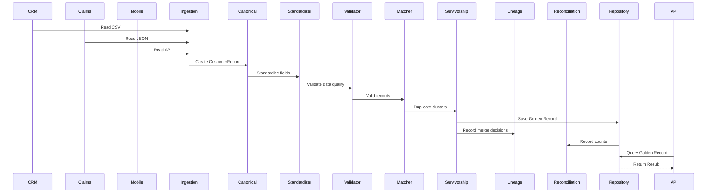
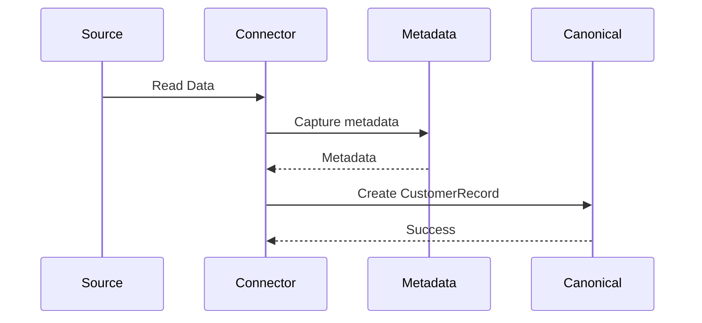
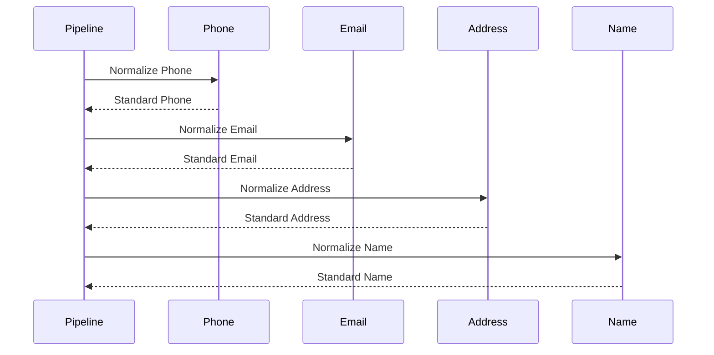
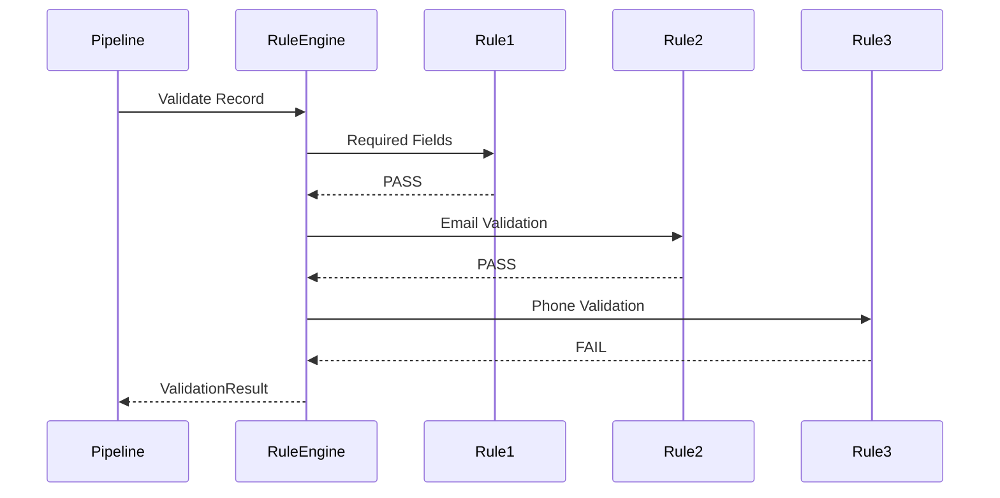
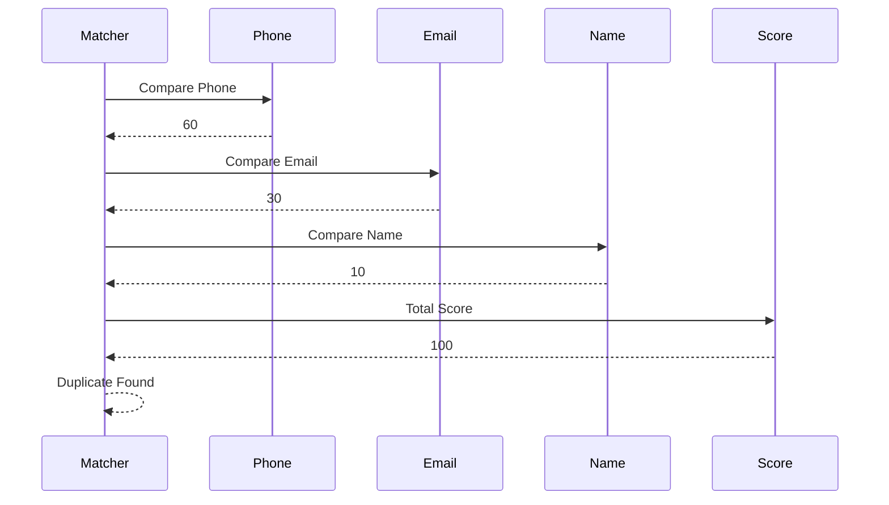
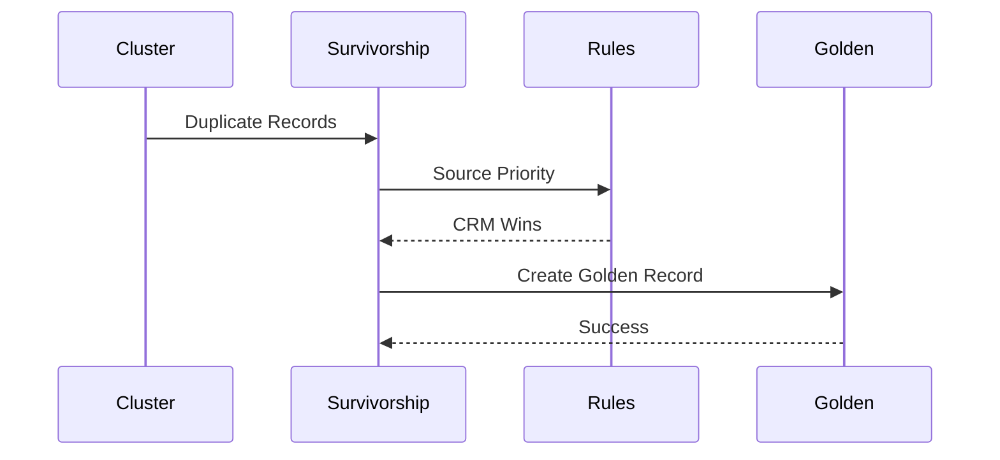
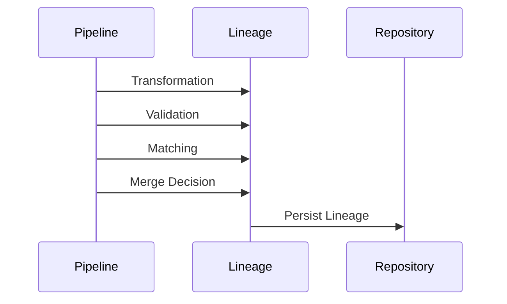
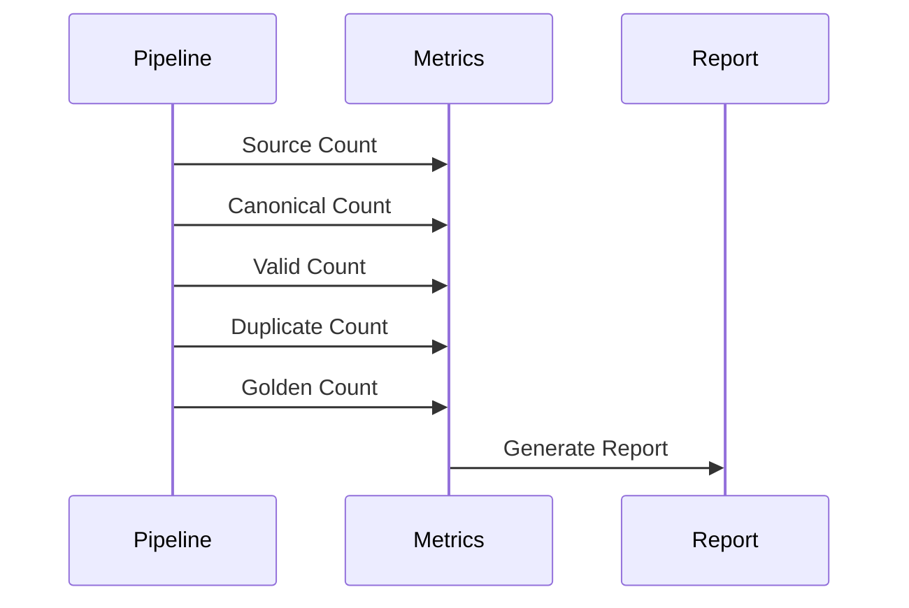
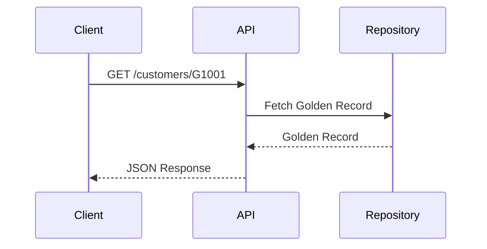
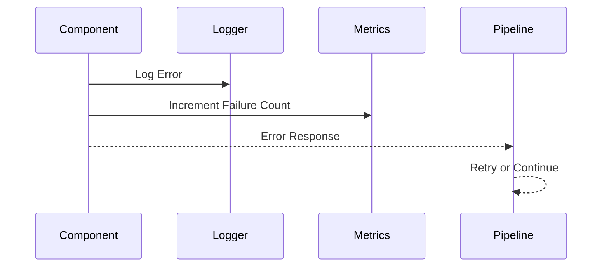

# Sequence Diagrams

**Project:** Enterprise Master Data Management (MDM) Platform

**Version:** 1.0

---

# 1. Overview

This document describes the runtime interaction between components in the Enterprise Master Data Management (MDM) Platform.

The platform follows a pipeline architecture where each stage transforms or enriches the data before passing it to the next stage.

Every stage captures metadata, logs execution details, emits metrics, and records lineage information.

---

# 2. End-to-End Processing Flow

```
        Source Systems
             │
             ▼
      Ingestion Framework
             │
             ▼
     Canonical Transformation
             │
             ▼
   Standardization Framework
             │
             ▼
    Data Quality Framework
             │
             ▼
 Identity Resolution Engine
             │
             ▼
   Golden Record Generator
             │
      ┌──────┴────────┐
      ▼               ▼
 Lineage         Reconciliation
      │               │
      └──────┬────────┘
             ▼
        Golden Record Store
             │
             ▼
          REST API
```

---

# 3. Complete Pipeline Sequence



---

# 4. Data Ingestion Sequence

Purpose

- Read heterogeneous sources
- Capture metadata
- Convert into canonical model



---

# 5. Standardization Sequence

Purpose

Normalize all customer attributes.



---

# 6. Data Quality Validation

Purpose

Validate configurable business rules.



---

# 7. Identity Resolution

Purpose

Determine whether multiple records belong to the same customer.



---

# 8. Golden Record Generation

Purpose

Generate one trusted customer record.



---

# 9. Lineage Tracking

Purpose

Maintain complete auditability.



---

# 10. Reconciliation

Purpose

Compare record counts between stages.



---

# 11. REST API Lookup

Purpose

Expose Golden Records to downstream systems.



---

# 12. Error Handling Flow



---

# 13. Pipeline Lifecycle

```
Read Sources

↓

Capture Metadata

↓

Canonical Transformation

↓

Standardization

↓

Validation

↓

Identity Resolution

↓

Duplicate Clustering

↓

Golden Record Creation

↓

Lineage Recording

↓

Reconciliation

↓

Persist

↓

Serve API
```

---

# 14. Processing States

```
RAW

↓

INGESTED

↓

CANONICAL

↓

STANDARDIZED

↓

VALIDATED

↓

MATCHED

↓

MERGED

↓

GOLDEN

↓

PUBLISHED
```

---

# 15. Parallel Processing Opportunities

The following stages can execute concurrently:

### Source Ingestion

```
CRM
Claims
Mobile
Employer
Partner

↓

Parallel Readers
```

---

### Standardization

```
Phone

Email

Address

Name

↓

Independent Execution
```

---

### Validation

```
Rule 1

Rule 2

Rule 3

Rule N

↓

Parallel Rule Evaluation
```

---

### Identity Resolution

Duplicate detection can be partitioned by:

- Country
- State
- Customer Hash
- Blocking Keys

This enables horizontal scaling across multiple workers.

---

# 16. Sequence Summary

| Stage | Input | Output |
|---------|--------|---------|
| Ingestion | Raw Data | CustomerRecord |
| Canonical | Source Record | Canonical Record |
| Standardization | Canonical Record | Standard Record |
| Validation | Standard Record | ValidationResult |
| Matching | Valid Records | Duplicate Clusters |
| Survivorship | Duplicate Cluster | Golden Record |
| Lineage | Pipeline Events | LineageRecord |
| Reconciliation | Pipeline Metrics | Report |
| API | Golden ID | Customer Response |

---

# 17. Future Enhancements

The sequence diagrams are designed to accommodate future capabilities without changing the overall processing flow.

Future enhancements include:

- Apache Kafka event-driven ingestion
- Change Data Capture (CDC)
- Apache Spark distributed execution
- Delta Lake / Apache Iceberg persistence
- ML-assisted entity matching
- AI-assisted survivorship recommendations
- Event publishing after Golden Record creation
- Workflow orchestration with Apache Airflow or Argo Workflows

The modular sequence ensures that new components can be inserted between existing stages while preserving loose coupling and maintainability.
